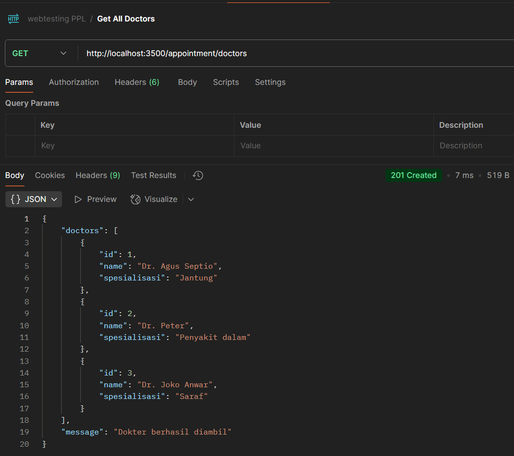
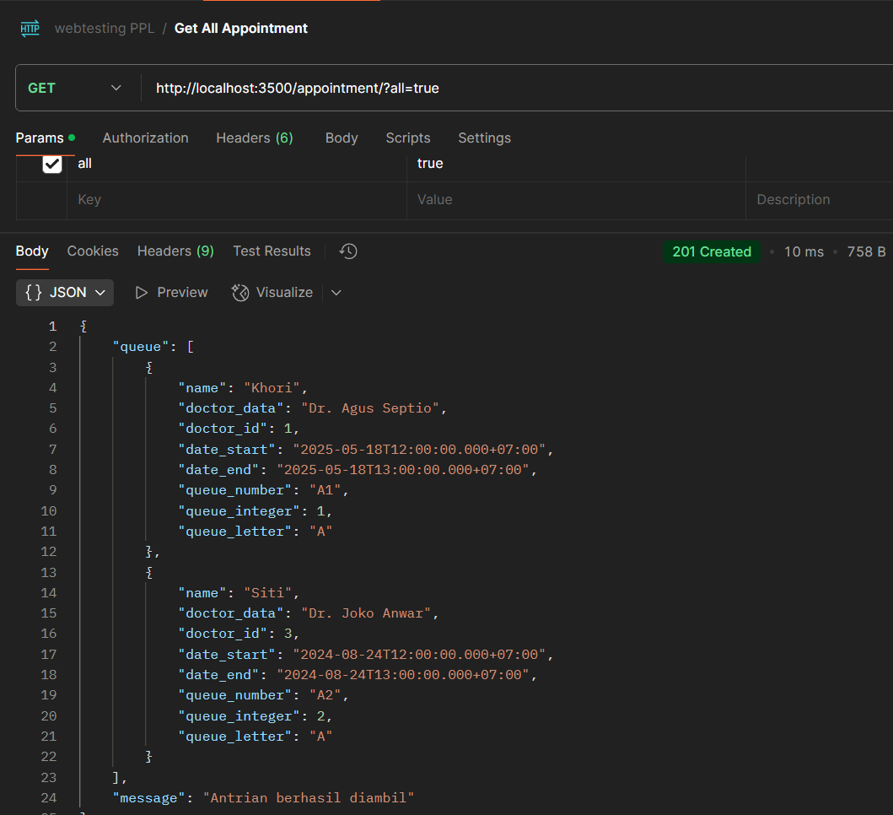
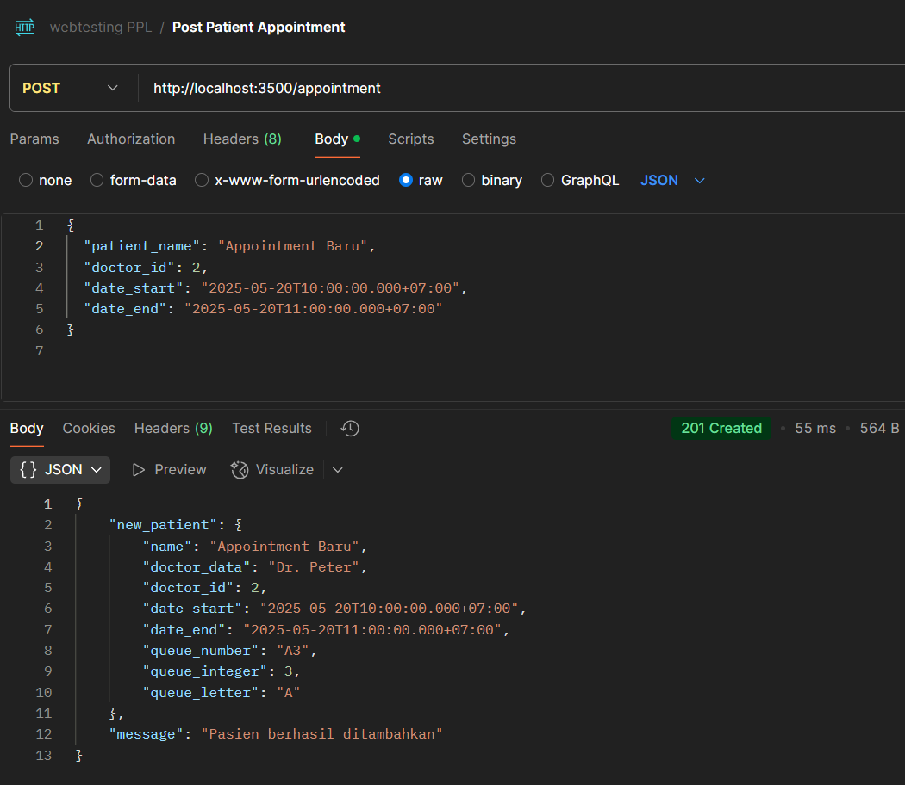
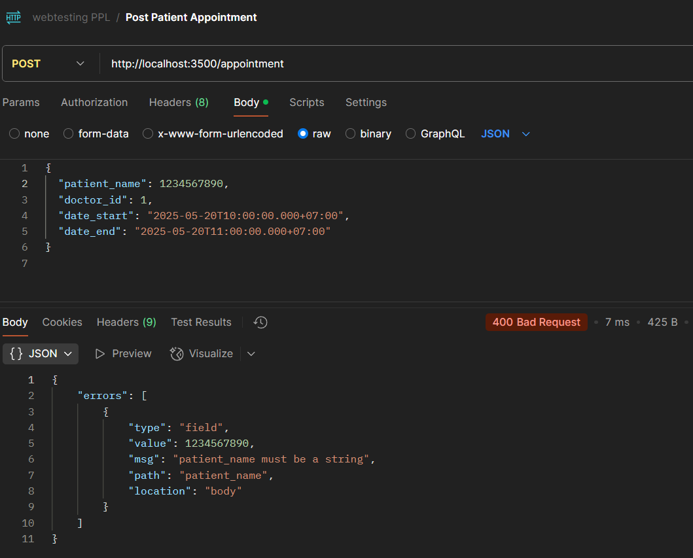
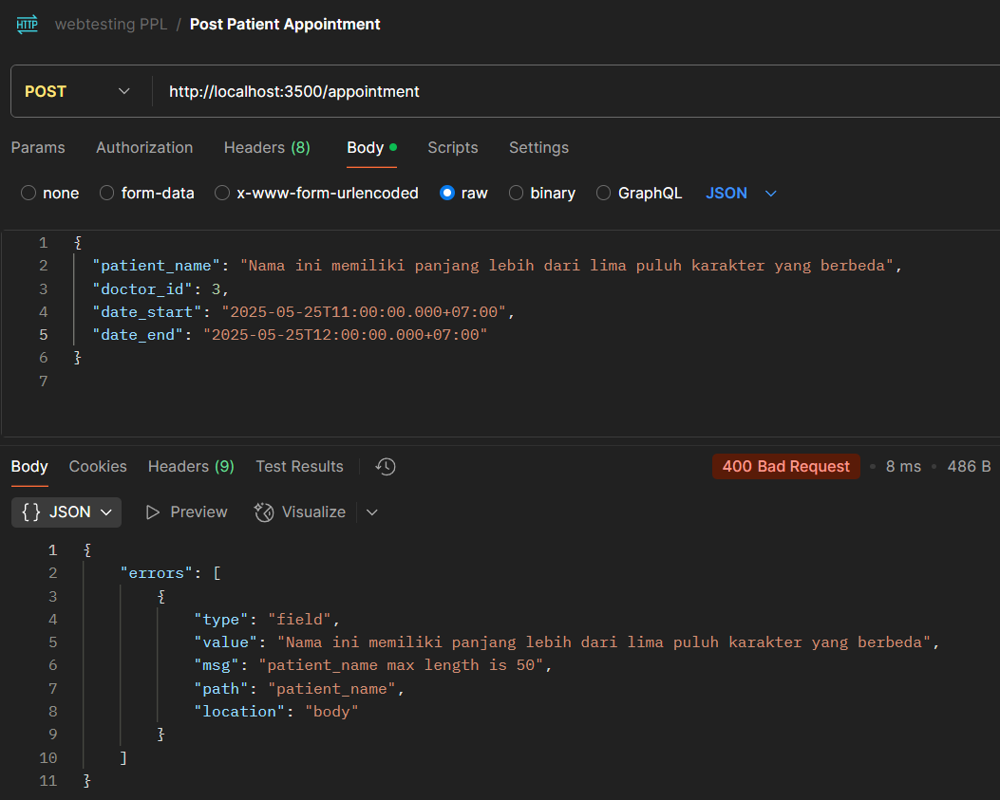
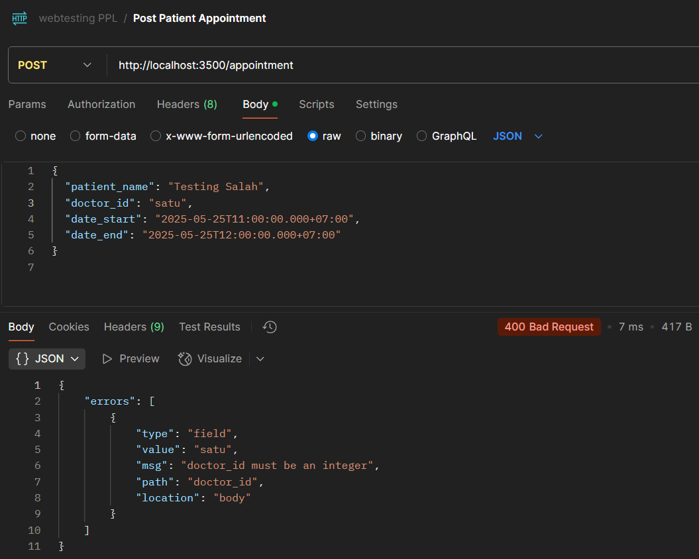

# Sistem Manajemen Rumah Sakit

Rumah sakit ingin meningkatkan efisiensi pendaftaran pasien dengan sistem antrean online untuk mengurangi waktu tunggu, sehingga pasien dapat mendaftar antrean secara digital dengan memilih dokter dan waktu kunjungan, serta menerima nomor antrean sebagai konfirmasi. Fitur ini memungkinkan pasien mengakses halaman utama yang menampilkan formulir pendaftaran dengan dropdown untuk memilih dokter (misalnya, "Dr. Andi - Spesialis Jantung" atau "Dr. Budi - Spesialis Mata") dan waktu kunjungan (misalnya, "09:00" atau "10:00"), serta kolom untuk nama pasien (wajib, maksimum 50 karakter); setelah mengisi formulir dan mengklik "Daftar Antrean", sistem menyimpan data dan menampilkan konfirmasi berisi nomor antrean (misalnya, "A001") dan detail (dokter, waktu, nama pasien), dengan data tetap tersedia setelah halaman di-refresh; jika nama pasien kosong, pengguna akan melihat pesan error "Nama pasien wajib diisi".

---

## 👥 Anggota Kelompok

| Nama Lengkap         | NIM             | Tugas / Peran              |
|----------------------|------------------|----------------------------|
| Wafi Afdi Alfaruqhi       | 22/503393/TK/55000        | Backend Developer         |
| Natanael Albert       | 22/503184/TK/54968        | QA tester          |
| Ramadhani Februarrahman       | 22/500335/TK/54838        | Frontend Developer  |

- QA Tester: menyusun user requirement, menganalisis fitur yang dibutuhkan dan acceptable criteria, menjalankan End-to-End testing fitur aplikasi secara manual, menyusun API test (black box testing).
- Backend Developer: membuat program di sisi backend, membuat dan menjalankan unit test (white box testing)
- Frontend Developer: membuat program di sisi frontend, membuat dan menjalankan unit test (white box testing)

## Fitur

1. Form buat isi antrean (nama pasien maks 50 karakter, list dokter serta spesialisai, dan waktu rentang)
2. List nomor antrean lain serta nomor antrean pada hari ini

## Acceptance Criteria

- Pengguna dapat mengakses halaman pendaftaran antrean dan sistem akan menampilkan formulir pendaftaran antrean yang terdiri dari:
  - Input nama pasien yang wajib diisi dan tidak lebih dari 50 karakter
  - Input dropdown untuk memilih salah satu dokter dari pilihan dokter yang berbeda 
  - Input dropdown untuk memilih salah satu waktu kunjungan dari pilihan waktu kunjungan yang disediakan
  - Tombol daftar antrean untuk mendaftar antrean menggunakan 3 input yang sudah dipilih
- Pengguna mendapatkan nomor antrean unik setelah mengisi semua input dengan valid
- Data nomor antrean tetap ada setelah halaman di-refresh
- Sistem mereset data nomor antrean yang disimpan di sistem ketika berganti hari

## Screenshot API Test

Get All Doctors

Get All Appointments

Post Appointment Successful

Post Appointment Patient Name as Number

Post Appointment Patient Name more than 50 characters

Post Appointment Doctor ID as string

Post Appointment date_start and date_end Invalid Format

Post Appointment date_start after date_end

## Screenshot Coverage Unit Test

Frontend

Backend

## Link Slide Presentasi

https://docs.google.com/presentation/d/1cUqjPYph0LGfjDPvAJG3Q9IZO8hfhABr/edit?usp=sharing&ouid=100161931075865245183&rtpof=true&sd=true
